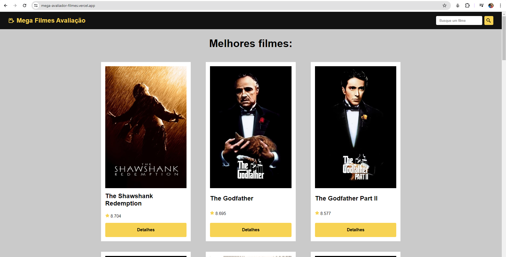
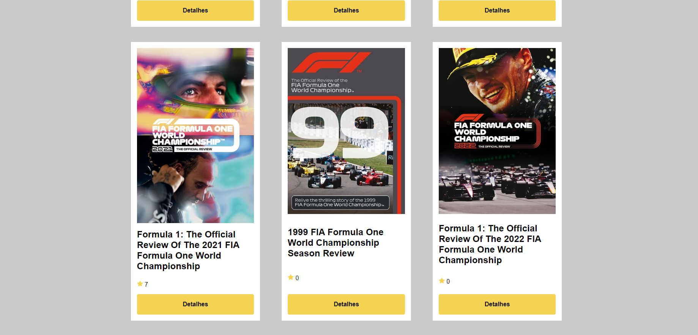
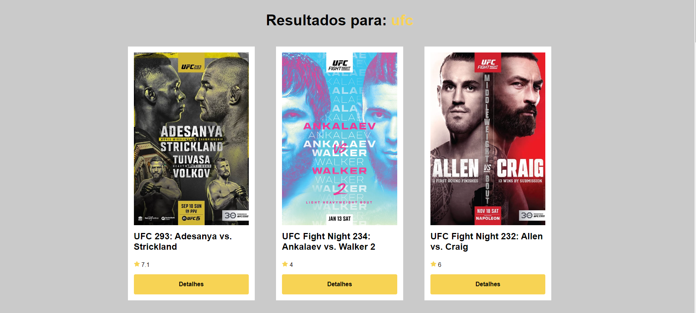
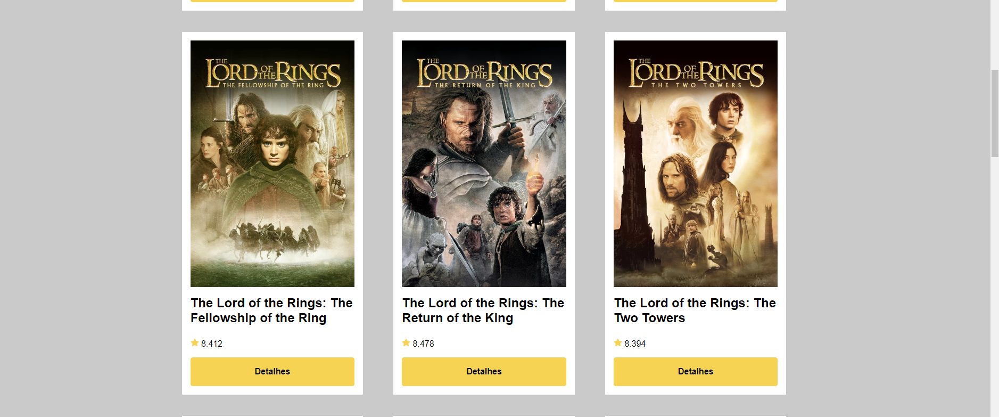

## 💻 Sobre o projeto

Mega Filmes Avaliação

Site de avalição de filmes e series, alem de eventos esportivos, com o objetivo de informar como cada evento ou filme foi avaliado pela critica, alem de uma descrição sobre

---

## ⚙️ Funcionalidades

- [x] Pagina principal
- [x] Pagina Avaliação:
- [x] Pagina de busca
---

## 🎨 Layout

### Web

  
  ---
  
  ---
  
  ---
  

---

## 🚀 Como executar o projeto

Clone este repositório
https://github.com/RuanPasseto/Desafio---Aplica-o-WEB.git

Antes de começar, você vai precisar ter instalado em sua máquina as seguintes ferramentas:
[VS Code](https://code.visualstudio.com/). 

Após clonar o projeto abra o VS Code e selecione a opção de abrir uma pasta local (Open a local folder) e escolha a pasta em que o arquivo foi clonado.
Execute o comando npm install para instalar as dependencias do projeto
Execute o comando npm run dev

✅ Pronto, o app estará rodando no host: (http://localhost:5173/)

---

## 🛠 Tecnologias

As seguintes ferramentas foram usadas na construção do projeto:

- **[Reactjs](https://react.dev/)
- ** [Vite](https://vitejs.dev/)
- ** [HTML 5.0](https://developer.mozilla.org/pt-BR/docs/Web/HTML)
- ** [css](https://developer.mozilla.org/pt-BR/docs/Web/CSS)

## 🚀 Hospedagem do projeto na Vercel

- ** [Mega Filmes Avaliação](https://mega-avaliador-filmes.vercel.app/)
